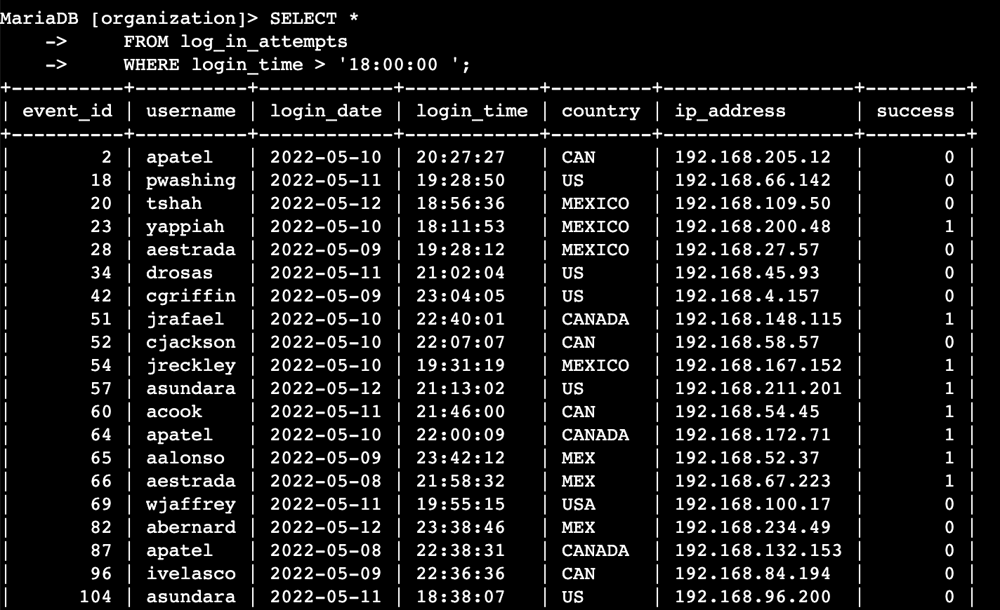
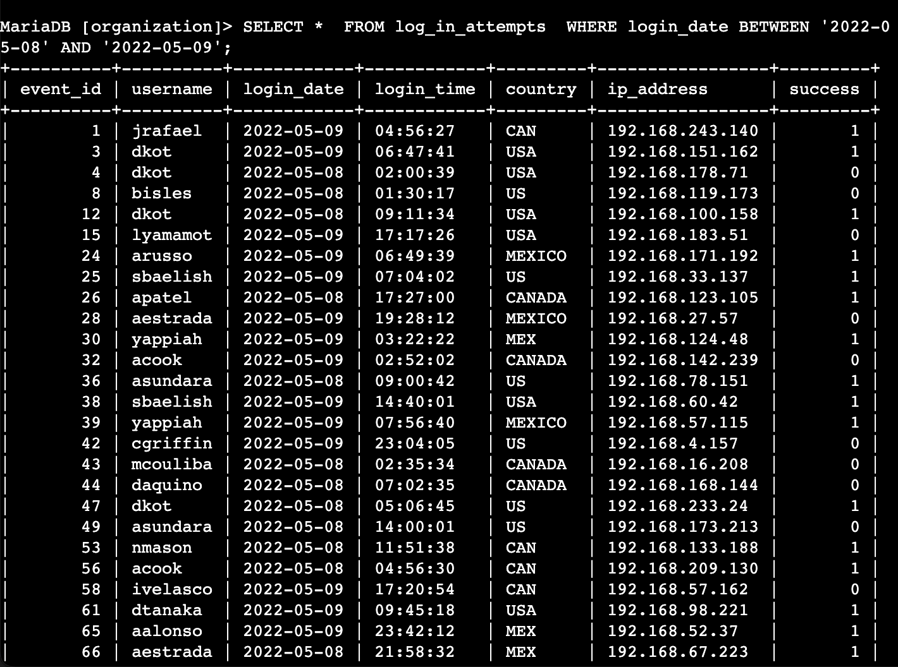
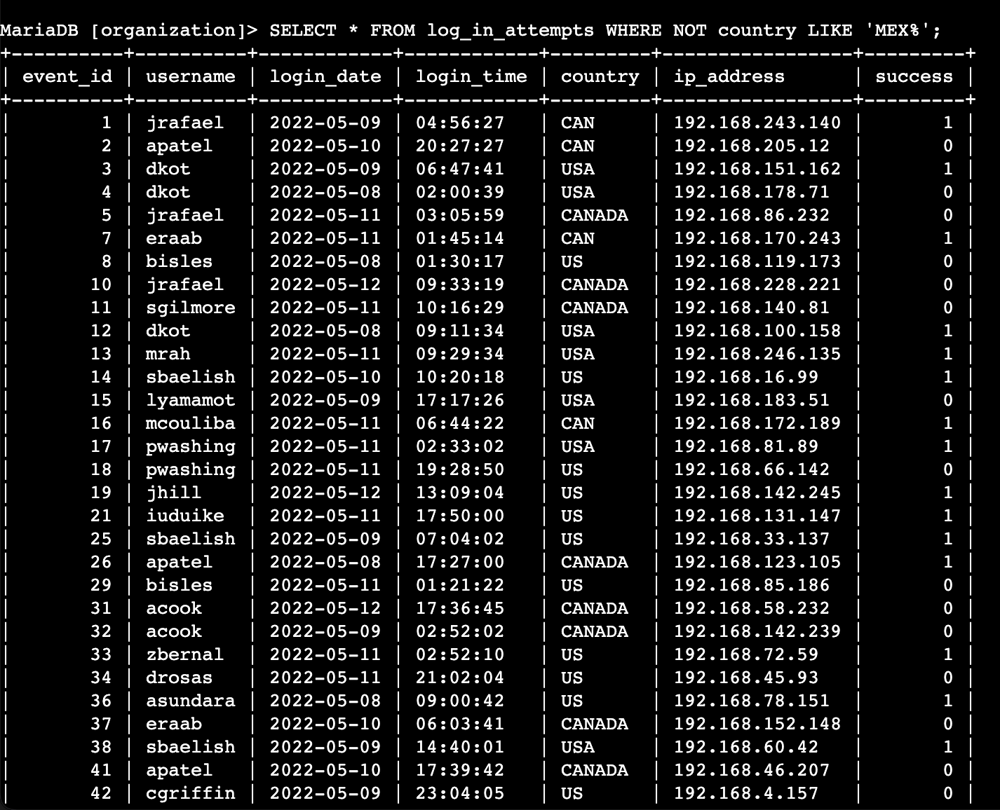
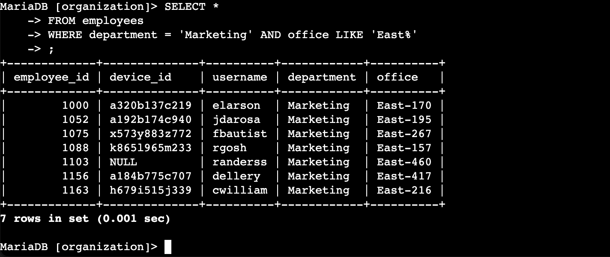
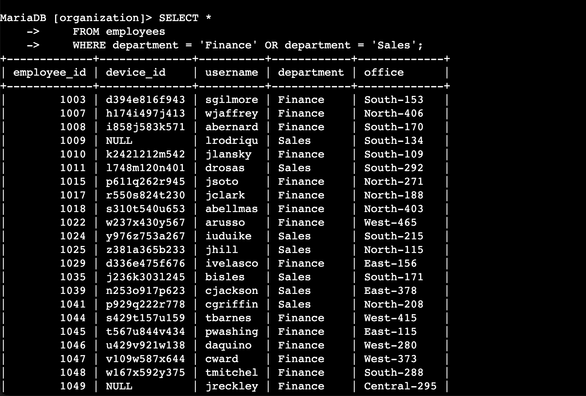
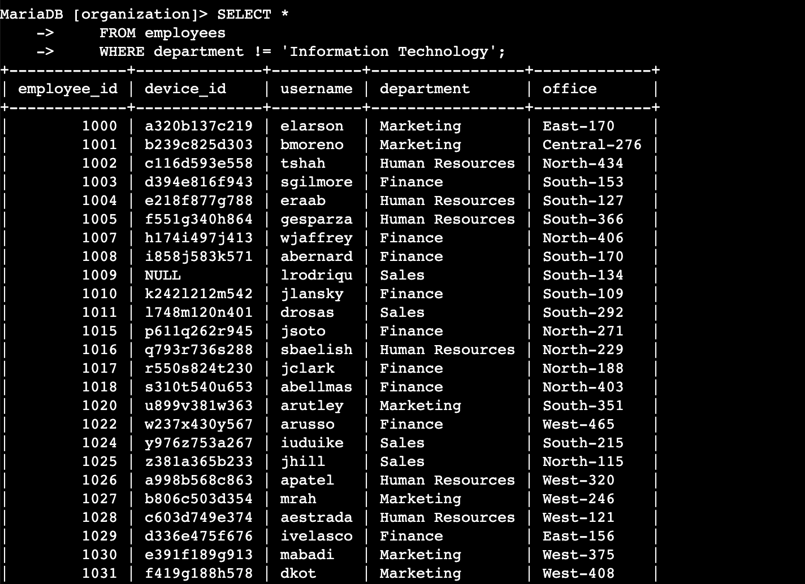

# Applying filters to SQL queries


### Project description
Define how to use filters and operators to refine results from SQL queries through specific scenarios involving the `employees` and `log_in_attempts` tables.

<br>
<br>

#### Retrieve after hours failed login attempts

Write the SQL query needed to retrieve data for login attempts made after closing hours ('18:00:00')

```
SELECT * 
    FROM log_in_attempts 
    WHERE login_time > '18:00:00 ';
```
Results:


<br>

#### Retrieve login attempts on specific dates
Use filters in SQL to create a query that identifies all login attempts that occurred on 2022-05-09 or 2022-05-08. 

```
SELECT * 
    FROM log_in_attempts 
    WHERE login_date BETWEEN '2022-05-08' AND '2022-05-09';
```


<br>

#### Retrieve login attempts outside of Mexico
Use filters in SQL to create a query that identifies all login attempts that occurred outside of Mexico.
```
SELECT * 
    FROM log_in_attempts 
    WHERE NOT country LIKE 'MEX%';
```
Results:


<br>

#### Retrieve employees in Marketing
Use filters in SQL to create a query that identifies all employees in the Marketing department for all offices in the East building.
```
SELECT *
    FROM employees
    WHERE department = 'Marketing' AND office LIKE 'East%';
```
Results:


<br>

#### Retrieve employees in Finance or Sales
Use filters in SQL to create a query that identifies all employees in the Sales or Finance departments.
```
SELECT *
    FROM employees
    WHERE department = 'Finance' OR department = 'Sales';
```
Results:


<br>

#### Retrieve all employees not in IT
Use filters in SQL to create a query which identifies all employees not in the IT department. 
```
SELECT *
    FROM employees
    WHERE department != 'Information Technology';
```
Results:


<br>
