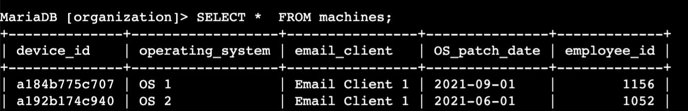
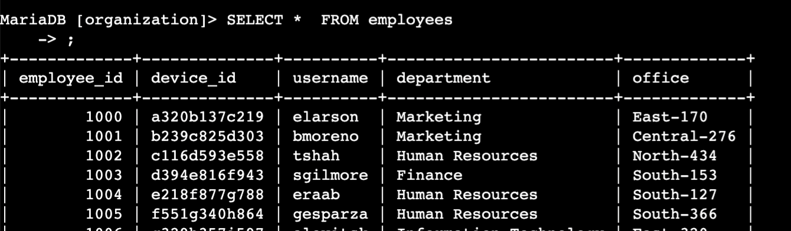
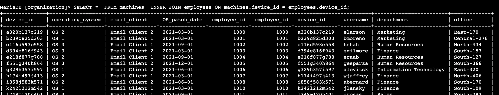
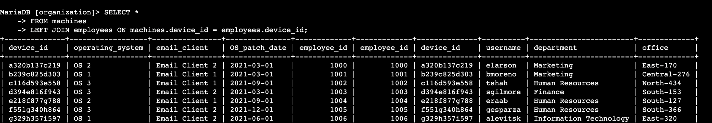
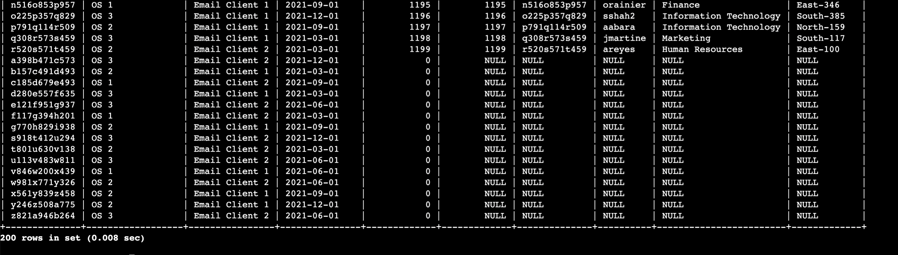
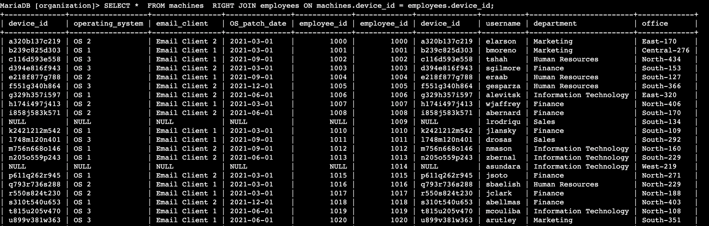

# Activity overview
As a security analyst, you’ll often find that you need data from more than one table.

Previously, you learned that a relational database is a structured database containing tables that are related to each other.

SQL joins enable you to combine tables that contain a shared column. This is helpful when you need to connect information that appears in different tables.

In this lab activity, you’ll use SQL joins to connect separate tables and retrieve needed information.

Get ready to apply what you’ve learned and join some data!

Note: The terms row and record are used interchangeably.

<br>


## Scenario
In this scenario, you’ll investigate a recent security incident that compromised some machines.

You are responsible for getting the required information from the database for the investigation.

Here’s how you’ll do this task: First, you’ll use an inner join to identify which employees are using which machines. Second, you’ll use left and right joins to find machines that do not belong to any specific user and users who do not have any specific machine assigned to them. Finally, you’ll use an inner join to list all login attempts made by all employees.

You’re ready to join tables in SQL!

#### Task 1. Match employees to their machines
First, you must identify which employees are using which machines. The data is located in the `machines` and `employees` tables.

Machines:


Employees:


You must use a SQL inner join to return the records you need based on a connecting column. In the scenario, both tables include the device_id column, which you’ll use to perform the join.

SQL Query:
```
SELECT *  
    FROM machines  
    INNER JOIN employees ON machines.device_id = employees.device_id;
```

Result: 


#### Task 2. Return more data
You now must return the information on all machines and the employees who have machines. Next, you must do the reverse and retrieve the information of all employees and any machines that are assigned to them.

###### Machines and their employees:
SQL Query:
```
SELECT *  
    FROM machines  
    LEFT JOIN employees ON machines.device_id = employees.device_id;
```
Result: 



###### Employees and their machines:
SQL Query:
```
SELECT *  
    FROM machines  
    RIGHT JOIN employees ON machines.device_id = employees.device_id;
```
Result: 
