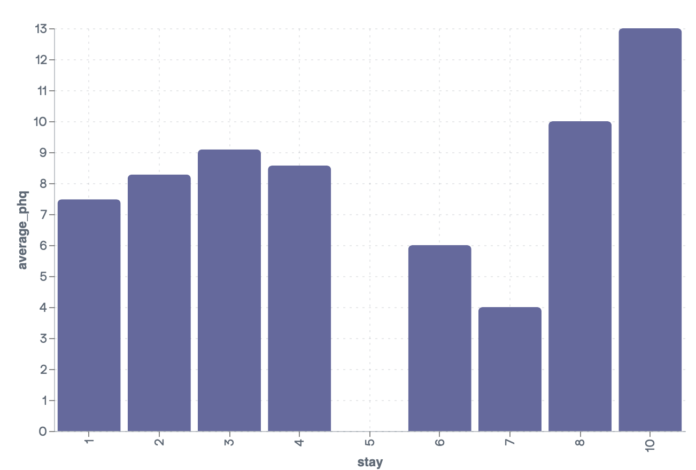
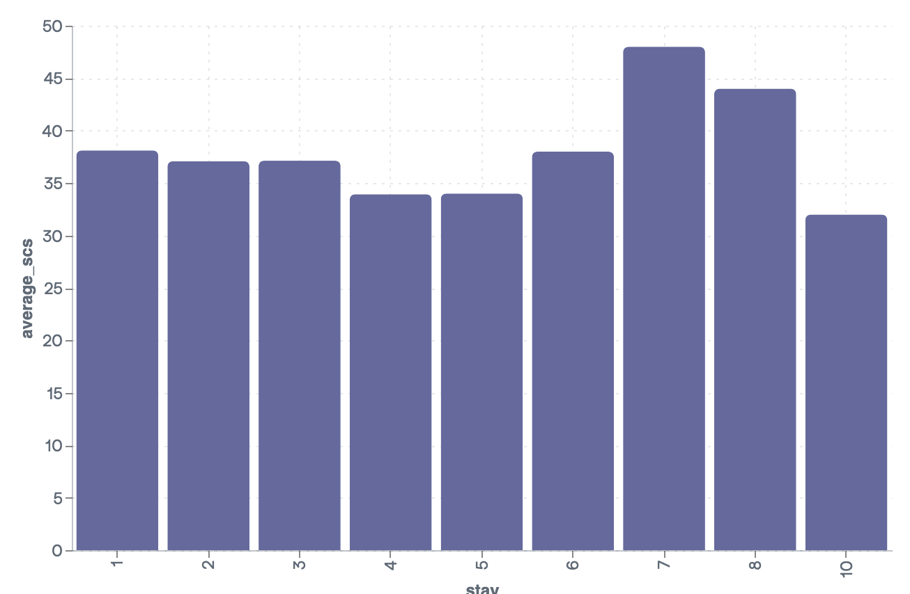
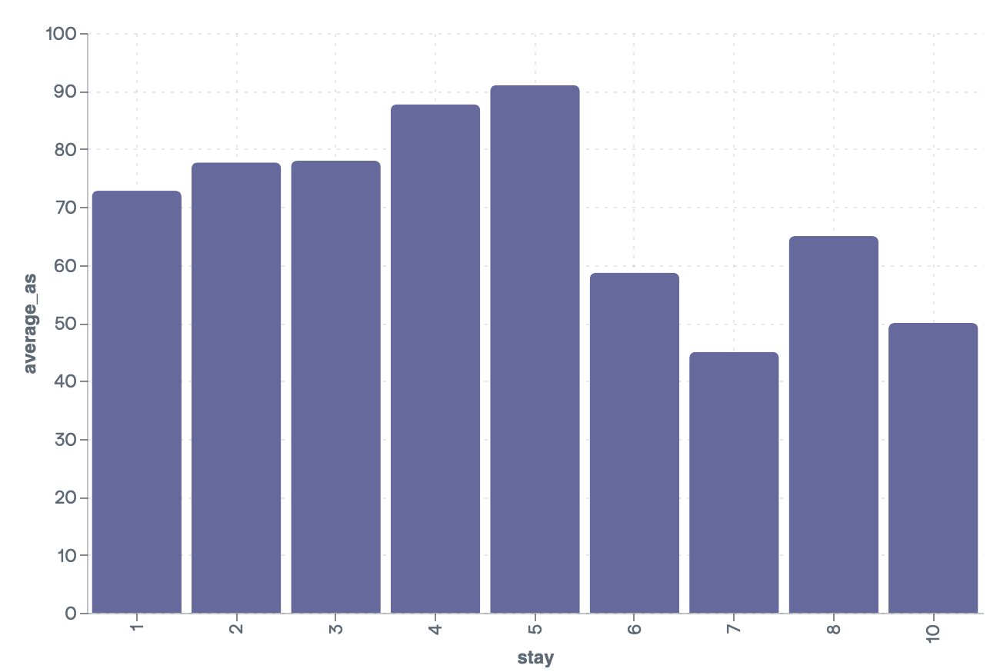

# RESULTS

After running the last queries in ```Query.sql``` you get the following output:


International Students:

 stay | count_int | average_phq | average_scs | average_as |
------|-----------|-------------|-------------|------------|
 10   | 1         | 13          | 32          | 50         |
 8    | 1         | 10          | 44          | 65         |
 7    | 1         | 4           | 48          | 45         |
 6    | 3         | 6           | 38          | 58.67      |
 5    | 1         | 0           | 34          | 91         |
 4    | 14        | 8.57        | 33.93       | 87.71      |
 3    | 46        | 9.09        | 37.13       | 78         |
 2    | 39        | 8.28        | 37.08       | 77.67      |
 1    | 95        | 7.48        | 38.11       | 72.8       |


## Observations

#### 1. Depression (PHQ-9 scores): 
 
This test is a widely used tool to assess depression severity ranging from **0 (Minimal or None) to 27 (Severe)**. International students tend to have a depression score (PHQ-9) ranging form mild to moderate. The scores fluctuate across different stay durations, making it difficult to draw definitive conclusions. **More samples from longer stays (5–10 years) are needed to make an accurate statement.**  


#### 2. Social Connectedness (SCS scores):  

This test measures how connected individuals feel with others, ranging from **8 (social isolation) to 48 (very high social connectedness).**  

The data suggests that **social connectedness tends to remain relatively stable across different stay durations**, with most scores indicating moderate social connectedness. Interestingly, the **student with an 8-year stay reported a much higher SCS score (44),** which might indicate that longer stays can sometimes lead to increased social integration.  

However, shorter stays (1–4 years) show a **slight fluctuation**, suggesting that the initial adjustment period might bring **varying levels of social connectedness**. The score of **32 for the 10-year stay** contradicts this trend, but given the limited sample size for long stays, more data is needed to confirm any patterns.  
  

#### 3. Acculturative Stress (ASISS scores):
  
This test measures the stress international students experience while adapting to a new culture, ranging from **36 (low stress) to 180 (very high stress).**  

The data indicates that **acculturative stress is highest during mid-range stays (4–5 years)**, with scores peaking around **87–91**. This suggests that students in this range might be experiencing a **critical phase of cultural adjustment**, possibly dealing with long-term adaptation challenges.  

For **shorter stays (1–3 years), acculturative stress is still relatively high,** which aligns with expectations, as students in this phase are still adjusting to their new environment. However, stress levels appear to **drop slightly for longer stays (6+ years),** with scores between **45 and 65**, which could suggest that students gradually adapt over time.  

Overall, the data supports the idea that acculturative stress is most intense **during the mid-range of the stay** and may begin to **decline as students settle into their new cultural environment.**  
  

## Conclusion:  
In general, international students experience **varying levels of depression, social connectedness, and acculturative stress** throughout their stay.  

The data does not show a clear trend linking longer stays to higher depression levels. Most students report **mild to moderate** depression scores, with some fluctuation across different stay durations. However, due to the limited number of samples for stays of 5+ years, further research is needed.  

Social connectedness remains **relatively stable**, with most scores reflecting moderate social connectedness. Interestingly, longer stays **do not always** correlate with higher social connection, as seen in the 10-year case. Shorter stays show **some fluctuation**, suggesting that the initial adjustment period affects social integration differently for each student.  

Lastly acculturative stress is **highest during mid-range stays (4–5 years)**, indicating a critical phase of cultural adjustment. Stress levels appear to decline for longer stays (6+ years), supporting the idea that students **gradually adapt to their new environment** over time.  

These findings suggest that **adaptation is not linear**—students may struggle at different points in their stay rather than simply improving over time. Psychological research supports the idea that while the brain adjusts to a new normal, the process may involve **periods of increased stress before stabilization**.  

Targeted efforts to support international students should focus on **providing mental health resources, fostering social support networks, and implementing cultural integration programs**—especially during the mid-range years, when acculturative stress tends to peak. Such interventions may help students **navigate critical adjustment phases more smoothly and promote overall well-being**.  
